# 几何

## 隐式几何

隐式几何：

 - 由满足特定关系的点组成的几何体，形如f(x,y,z) = 0

对于隐式几何，很难从表达式中判断几何体的形状，比如

$$
f(x,y,z) = (2-\sqrt{x^2+y^2})^2+z^2-1
$$

是一个圆环形状。但是几乎不可能从表达式直接看出它表示的是一个圆环。

隐式几何表达的好处是可以很容易判断一个点在不在目标几何体的表面上，结果小于0则在内部，大于0在外部，等于0才在表面上。

### 隐式几何的CSG

通过隐式几何的布尔运算进行组合，拼接出新的几何体。

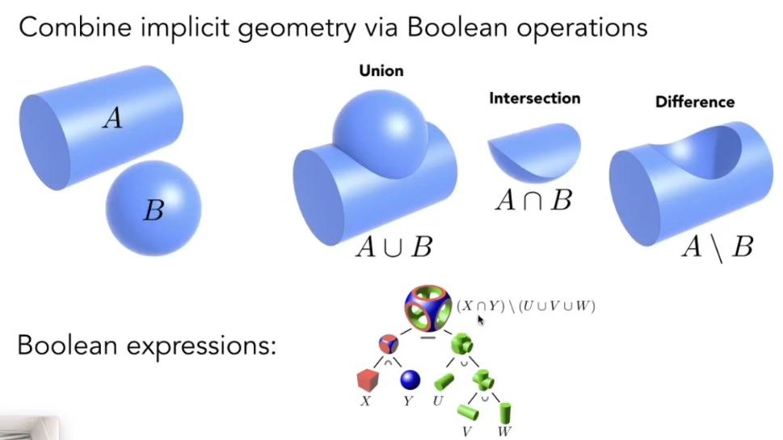

### 距离函数

使用距离函数逐渐混合物体表面，从而形成新的物体。

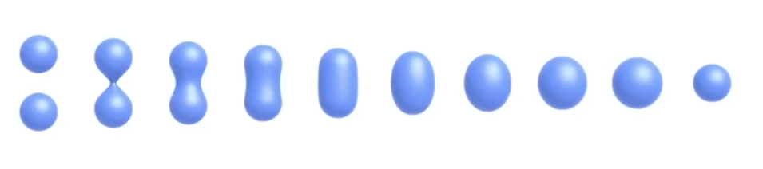

在还原表面时，使用水平集还原。水平集通常使用有符号距离场实现。举例球体的水平集，对于一个球心在原点、半径为R的球体，它的水平集函数就是：
$$
F(x,y,z)=\sqrt{x^2+y^2+z^2}-R
$$

## 显式几何

显式几何：

 - 由三角形面拼接成的几何体

显式几何表达可以作为映射处理。如给出一个uv坐标，转换到三维空间的xyz坐标系。

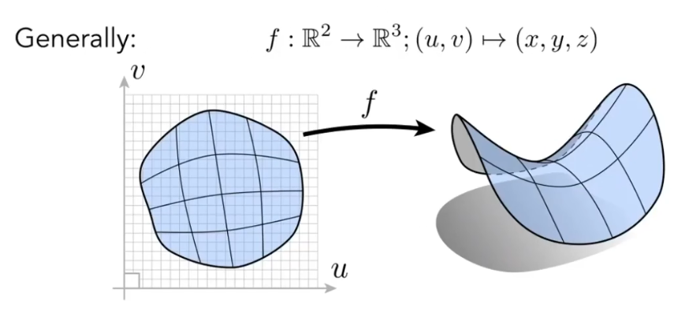

显式几何也有几种不同的表示方式。

### 点云

我们不认为几何体由面组成，而是由一个个的点组成，点云足够密集时则呈现几何体。在渲染时再将点云还原为一个个的三角形面，或者使用不同的着色方法渲染出光滑表面。

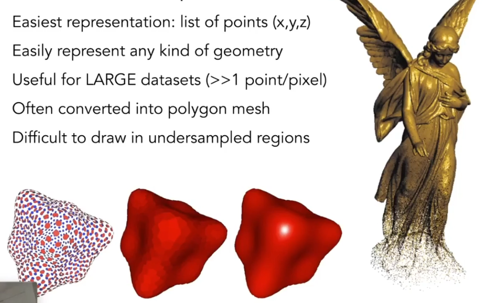

### 多边形面

最常见的三角形或多边形拼接组成的几何体。

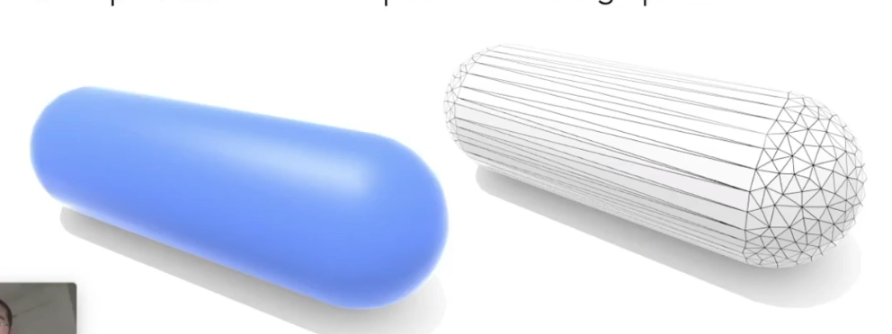

## 贝塞尔曲线

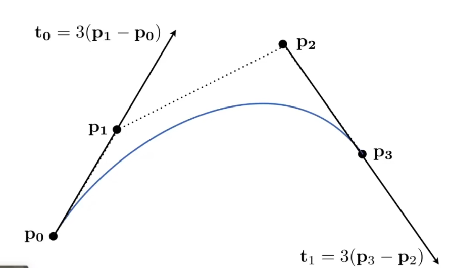

由一系列控制点决定的一条曲线。

### 二次贝塞尔曲线

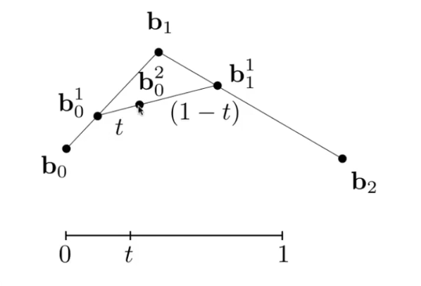

定义一个参数t，取b0，b1两点连线比例为t的点，同样取b1，b2两点连线比例为t的点，再取这两点连线上比例为t的点，即为取参数t时贝塞尔曲线的坐标点。对于参数t，取[0-1]的所有值，得出的点相连即为当前三点b0,b1,b2决定的二次贝塞尔曲线。

在实际计算时，不必依次按照上述过程声明迭代，可以提前进行公式计算，利用公式直接求值。

$$
b_0^1(t) = (1-t)b_0+tb_1\\
b_1^1(t) = (1-t)b_1+tb_2\\
b_0^2(t) = (1-t)b_0^1+tb_1^1\\
\\
b_0^2(t) = (1-t)^2 b_0+2t(1-t)b_1+t^2b_2
$$

### 三次贝塞尔曲线

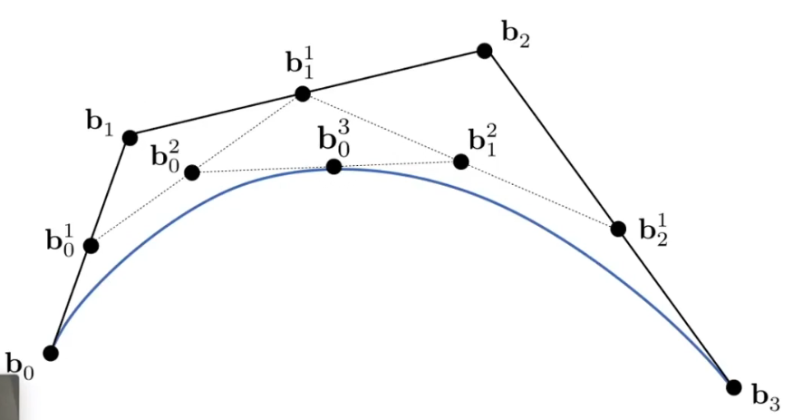

和二次贝塞尔曲线类似，对四个点做相似的操作，得到对应的三次贝塞尔曲线。

同样的，可以提前计算出公式。

### n次贝塞尔曲线

对于n次贝塞尔曲线，我们也可以直接推导出计算公式：

$$
b^n(t) = b_0^t(t) = \sum_{j=0}^{n}b_j B_j^n (t)
$$

最后的$B_j^n(t)$即伯恩斯坦多项式(Bernstein polynomial)，展开表达式为：
$$
B_i^n=C_i^n t^i (1-t)^{n-i}
$$

贝塞尔曲线在做仿射变换时，无需重新计算整条曲线上的每一个点，可以仅变换对应的控制的，然后再重新绘制曲线。

但是在进行投影变换时不可以根据控制点重新绘制，必须记录已有曲线的每一个点。

贝塞尔曲线拥有凸包性质，整条曲线一定在控制点组成的凸包内部。

### 分段贝塞尔曲线

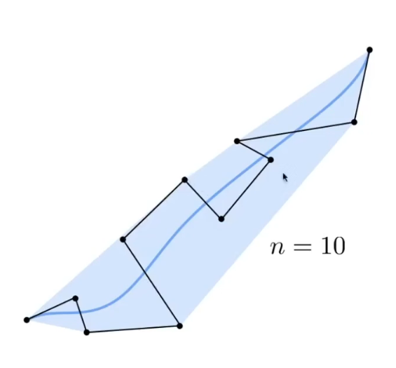

对于过于曲折的控制点，绘制出的曲线并不能很好地体现出控制点的位置变化趋势，这时可以将控制点分组，分段绘制出贝塞尔曲线后再进行拼接。

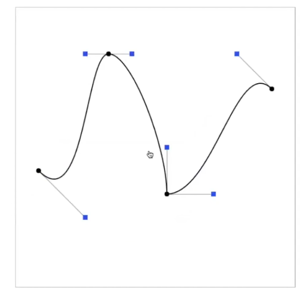

### 其它形式的曲线

B-Splines曲线，和贝塞尔曲线不同，允许控制整条曲线的一部分，而不影响其他部分的曲线。

### 贝塞尔曲面

标准的双三次贝塞尔曲面由 4x4 个控制点定义。其计算本质是两次套用伯恩斯坦多项式。
$$
P(u,v)=\sum^{3}_{i=0}\sum^{3}_{j=0}B_{i,3}(u)B_{j,3}(v)P_{i,j}, (u,v)\in[0,1]
$$

曲面可被视为两条曲线的乘积结构，因此可以将同一个点$ P_{i,j} $的两个方向的控制权重直接相乘，求和得到整个平面上控制点对于当前位置的控制后位置。

## 几何操作

### 几何细分

增加几何体的三角形数目，使几何体变得更加光滑，类似增加图像的分辨率。

表面细分分为两部分，分解表面和调整顶点位置。

#### Loop Subdivision

> Loop Subdivision并不是循环细分，而是算法的发明者姓Loop，有点搞

在细分时，将顶点分为已经存在的旧顶点和新增的新顶点。

对于新顶点，位置为$3/8 * (A+B)+1/8*(C+D) $

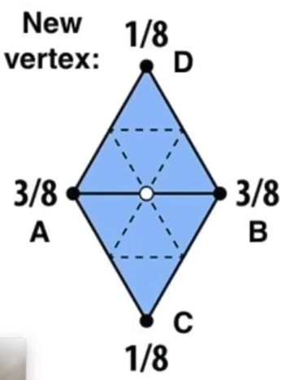

对于旧顶点，位置更新为$(1-n*u)*original\_postion+u*neighbor\_postion\_sum$

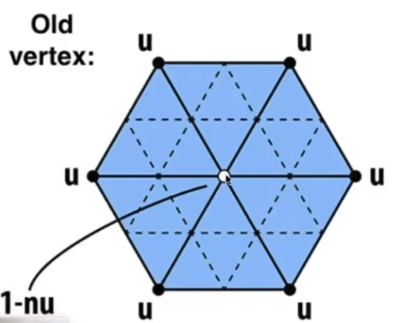

其中n为旧顶点的度，u

#### Catmull-Clark Subdivision

可以用于非三角形的几何细分。

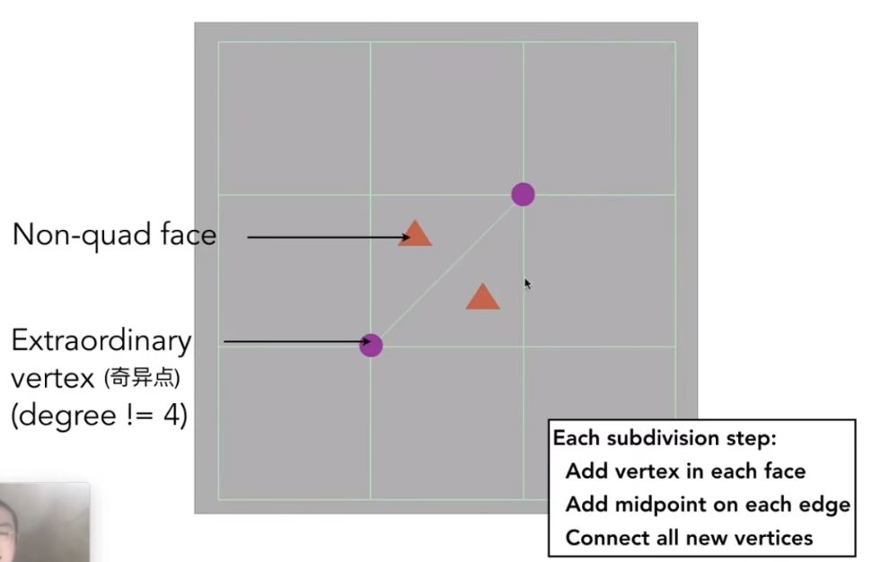

取存在的每一条边的中点，同时取每个多边形面的内部点，连接内部点和相邻的中点。细分后的图形全部为四边形，同时根据初始图形的非四边形面数量增加奇异点数量。

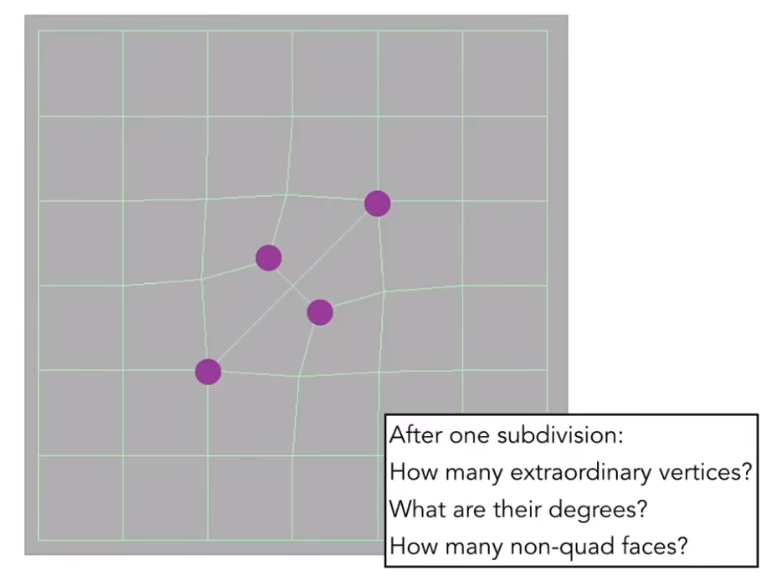

对于新的内部点f，计算公式：
$$
f = \frac{v_1+v_2+v_3+v_4}{4}
$$

对于新的中点e，计算公式：
$$
e = \frac{v_1+v_2+f_1+f_2}{4}
$$

对于旧的顶点。计算公式：
$$
p = \frac{f_1+f_2+f_3+f_4+2(m_1+m_2+m_3+m_4)+4p}{16}
$$

### 几何简化

降低几何体的面数，使几何体性能开销更小，比如对于较远的物体，即使计算较多的面数渲染后也和低面数模型区别不大，就可以降低几何体面数。

几何简化可以通过边坍缩实现。

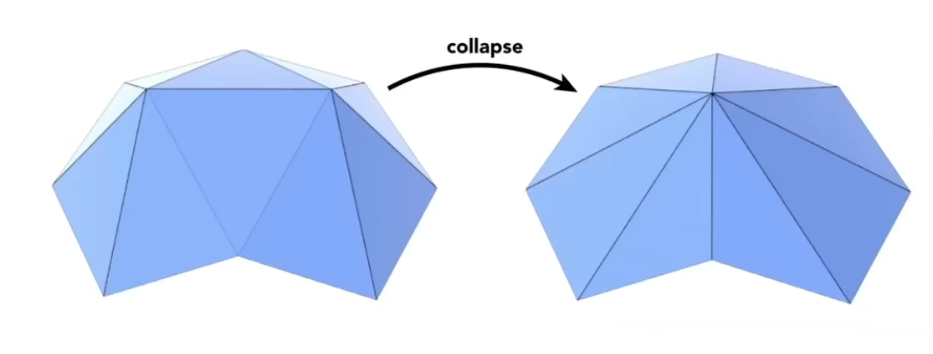

#### Quadric Error Metrics 二次误差度量

对于要化简的几个面，将新的顶点设置为：使新的顶点到其它参与化简的顶点的距离差平方和最小。

在实际操作中，一般是从距离差平方和最小的顶点开始坍缩，这需要每次都能取到距离差平方和最小的点，同时在坍缩后及时更新受影响的点，并重新进行排序。

### 几何规整

几何体的各个面大小可能不同，对于渲染会造成很大的不便。通过几何规整将各个面的大小规格整合至相近。