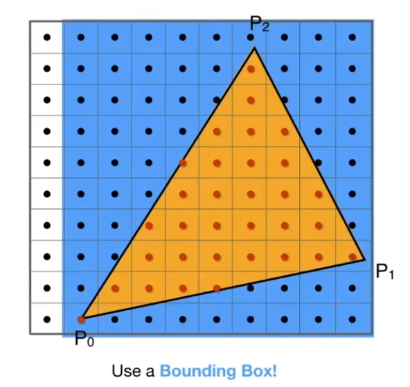
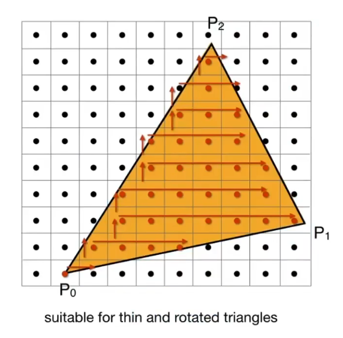
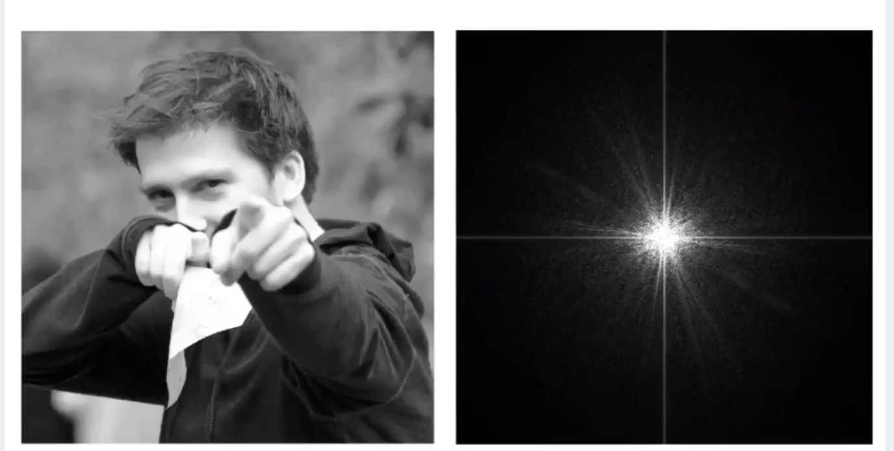
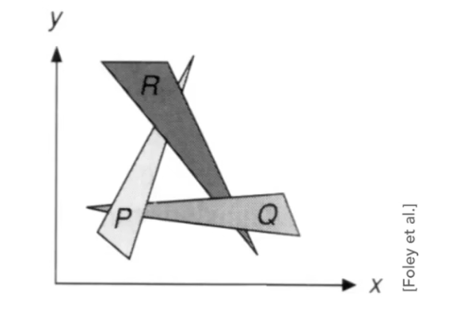
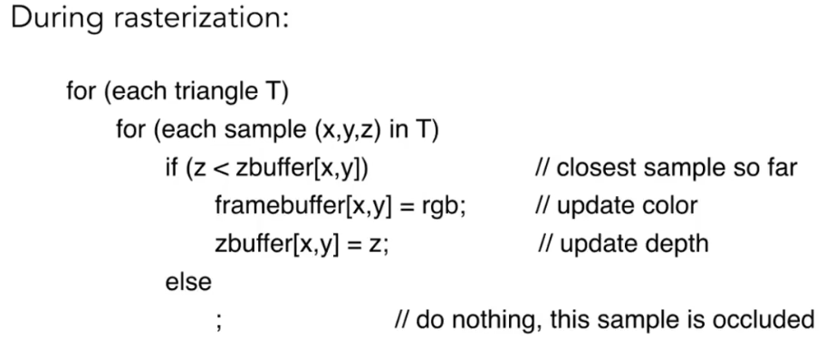

# 图形学 光栅化

## 规范立方体 & 视口变换

在MVP变换后，我们从裁剪空间得到一个规范立方体(Canonical Cube)，其坐标范围在x,y,z三个维度上均为[-1,1]。也被称为归一化设备坐标(NDC)空间。

为了将规范立方体中的物体显示在屏幕上，我们需要先进行视口变换，将坐标范围为[-1,1]的立方体变换为[0,width]*[0,height]大小的视口。对应的视口矩阵为：

$$
M_{viewport} =
\begin{bmatrix}
\frac{width}{2} & 0 & 0 & \frac{width}{2} \\
0 & \frac{height}{2} & 0 & \frac{height}{2} \\
0 & 0 & 1 & 0 \\
0 & 0 & 0 & 1
\end{bmatrix}
$$

在这个过程中，进行了`将NDC平移至视口正中间-->将NDC宽高缩放到与视口一致`的过程，使即将显示的内容与视口大小、位置匹配。

## 光栅化

### 三角形

三角形是图形的基本形状单元，图形学上的基本形状单元采用三角形。

- 最基础的形状，所有图形的最终分解状态都是三角形
- 保证不管什么情况下，单体三角形都是二维的
- 内外定义清晰，不会出现多边形凹凸不一致导致的判断内外困难

### 光栅化

根据三角形在像素点上的重合情况，进行采样，将符合条件的像素点渲染为指定的颜色。

最基本的光栅化方式如上图所示，框选三角形的最高\最低\最左\最右点，依次遍历矩形中的每一个像素点，根据指定的规则(最基础地，像素点中心是否在三角形内)渲染图形。

不过这种方式效率很低，至少会浪费一半的遍历周期在明显不处于三角形内部的像素点上。因此有很大的优化空间，一种简单的优化方式如图：

确认三角形的一个边界渲染像素后，以该像素为起点，逐行扩散遍历。

### 走样 & 反走样

此外，还有一个问题，这种明确规定显示\不显示的方式在分辨率较低或图形较小的情况下，会产生锯齿状的边界，即走样。

常见的走样有：
- 锯齿
- 摩尔纹

走样的产生原因是对高频信号的低频采样，低频采样得到的结果在还原时，会产生和原信号较大的偏移，难以还原出与原信号相近的信号。

为了对抗走样，常见的一种方式是滤波。

在图片中，图片的图像可以看做信号的时域，信号频率的高低即相邻像素的变化率，经过傅里叶变换后。可以得到图片右侧的频域图像。

在频域视角看：
- 图像可看作由不同频率的信号组成；
- 采样相当于在频域中周期性复制原始频谱；
- 如果原始信号包含高于奈奎斯特频率（采样率/2）的成分，复制后的频谱会重叠，即走样；
- 解决方法：在采样前，用低通滤波器去除高频成分，使频谱不再重叠。

低通滤波的结果即模糊(blur)，虽然牺牲了清晰度，但是改善了走样程度。

低通滤波可用卷积(Convolution)实现。用图片举例，卷积就是选择一块区域的像素，对这块区域像素的色值取平均值，得到中心区域像素的色值。常用的卷积核有均值滤波、高斯加权滤波等。

不可以先采样再模糊，不然只是模糊了已经走样的信号，还原出来还是走样的信号。

常见的现代反走样方式有：

- MSAA: 对于渲染部位增加采样点，通过模拟色值色差反走样
- FXAA：快速近似抗锯齿，图像后期处理，替换走样的图像边界
- TAA： 时间抗锯齿，将当前帧和之前的帧进行对比分析进行模糊处理
- Super sampling：超分，通过深度学习等方式模拟、预测采样

也可以单纯的增加采样率，不过代价很高。

### Z-buffering 深度缓存

在实际渲染中，会有很多物体渲染在屏幕上，这就涉及到物体之间的遮挡问题。

一种简单的处理方式是画家算法，优先画出远处的物体，再画出近处的物体，表现物体的自然遮挡。对于简单的绘制这是一种简单有效的处理方法，但是如果物体之间出现了较为复杂的遮挡，比如：

画家算法就不能正确判断出物体渲染的先后顺序。

因此，为了解决这个问题，在图形学中引入了Z-buffering深度缓存。

深度缓存对图形的每个像素点分别处理，记录像素点的深度值：
- frame buffer 记录色值
- depth buffer 记录深度

在进行计算时，同时生成两幅图像，一副是实际渲染的图像，一副是深度图像，用于记录每个像素点的深度。

初始默认每个像素点的深度都是无限大，在绘制像素时，检查当前绘制位置的深度值，如果新的像素深度小于当前位置的深度，则在渲染图像中渲染该像素，同时在深度图像中用更小的新像素深度覆盖当前位置的深度；如果新的像素深度大于当前位置深度，则跳过本次渲染，不进行操作。

