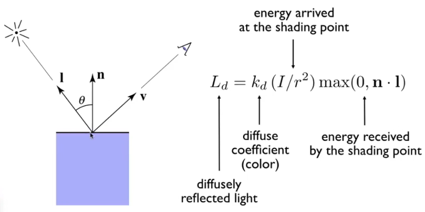
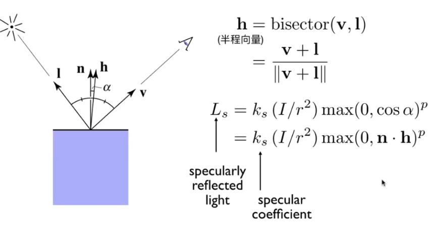
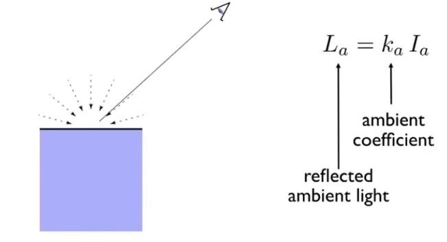
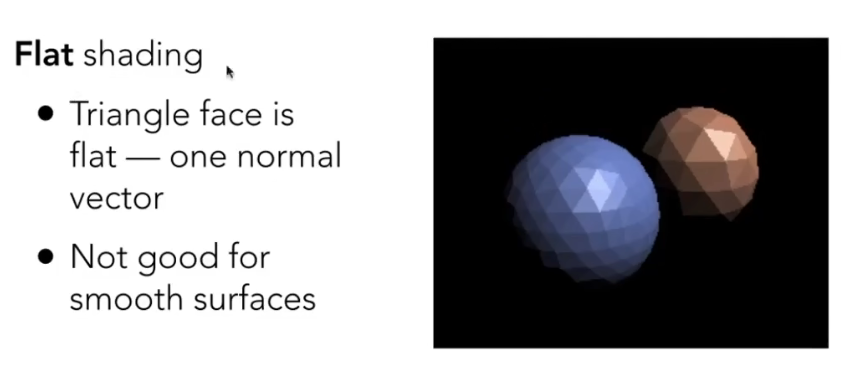
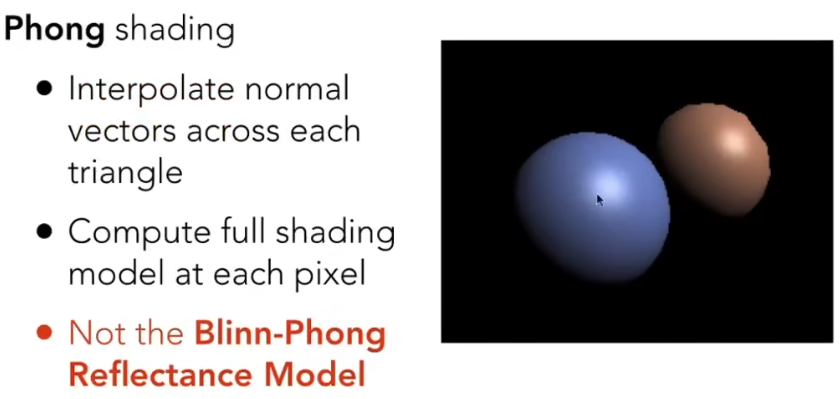
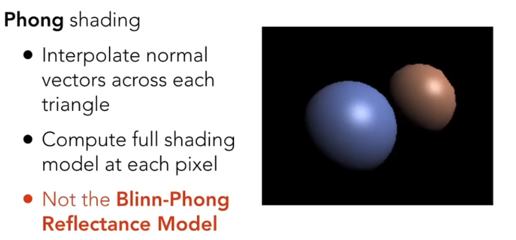
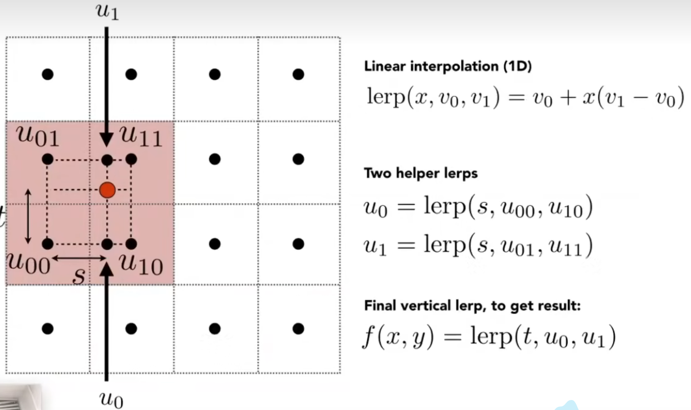
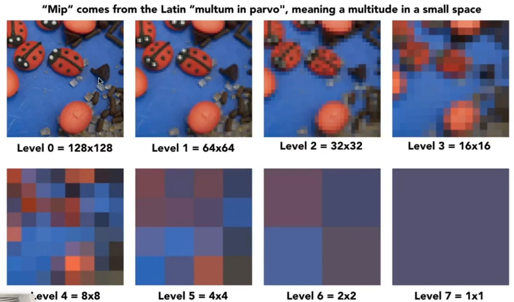
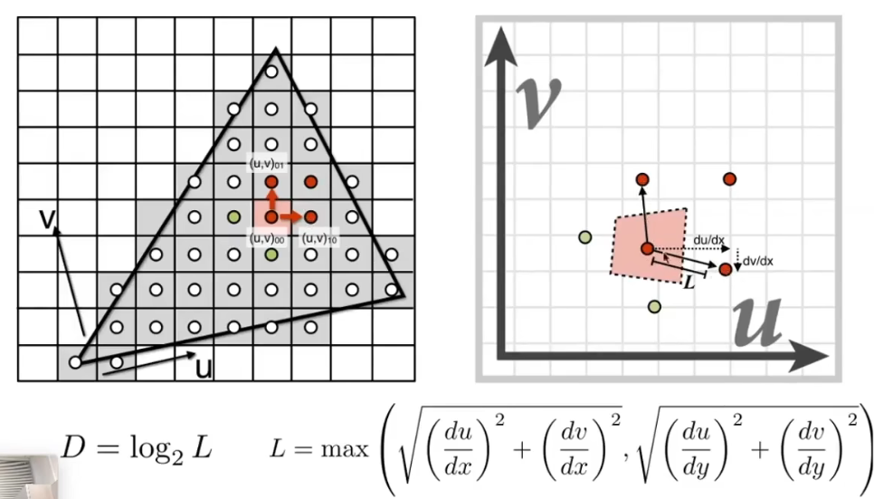
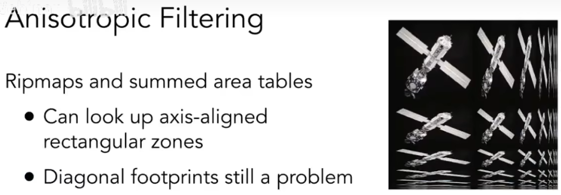

# 着色

## Definition

>shading:

>The darkening or coloring of an illustration or diagram with parallel lines or a block of color

在图形学中，可以理解为对物体应用不同的材质。

## Blinn-Phong 反射模型

着色时的输入参数：
- Viewer direction，视线方向
- Surface normal，表面法线方向
- Light direction，光线方向
- Surface parameters，物体表面的参数，如颜色、粗糙度

着色时，对于物体表面的着色是局部的，意思是不考虑自身以外的着色。比如不考虑物体在光照下投射的阴影。

### Diffuse Reflection 漫反射

将光线在物体表面均匀地向各个方向散射。反射光线的强度与物体与光线的夹角有关，因为单位面积接受到的能量不同。

因为漫反射是均匀地反射射入光线，所以不管在什么地方观察，观察到的着色效果应该是一样的。

### Specular 高光

反射方向接近于镜面反射方向。在判断是否产生高光时，计算光线入射向量和视线向量的半程向量，即取角平分线方向，只需要检查半程向量和法线向量是否足够接近。

公式中的指数p意在控制高光的大小，对于点乘，cos变换的容忍度过高，比如半程向量和法线向量偏移45°时，和完全重合计算得出的值差别并不大，导致高光的面积可能过大。因此需要进行指数运算，增强计算结果的变化率。

### Ambient Term 环境光

为物体添加一个常数光照，不受外界影响，为了避免有的地方是完全黑色的。Blinn-Phong的环境光是对实际情况的简化，仅模拟最简单的环境光。

将三种光照效果合成，就是最终的着色效果。

## Shading Frequencies

着色频率，决定每次着色区域的大小。

### Flat Shading

对每个三角形着色。同一个三角形中的所有像素点着色效果相同。

### Gouraud Shading

对每个三角形的顶点着色，三角形内部的像素着色使用顶点的着色插值着色。

### Phong Shading

只传递顶点的法线向量，对每个像素插值得到像素点的法线向量，再逐像素计算着色。

>怎样得到顶点的法线向量？

>根据和顶点相连的几个三角形，根据三角形的法线向量加权平均计算顶点的法线向量。

## Real-Time Rendering Pipeline 实时渲染管线

输入：原始3D空间

- Vertex Processing:将原始3D空间转换为屏幕视口空间
- Triangle Processing:将屏幕空间的顶点转换为三角形
- Rasterization:将需要绘制的三角形光栅化为像素点
- Fragment Processing:为像素点着色
- Framebuffer Operations:将着色后的像素点显示在屏幕上

对于不同的着色算法，着色发生的流程也有所不同。如果采用Gouraud Shading顶点着色，则着色发生在Vertex Processing(计算颜色)、Rasterization(进行颜色插值)和Fragment Processing(使用插值颜色)；Phong着色发生在Vertex Processing(传递顶点法线向量)、Rasterization(进行重心坐标插值，插值生成法线向量)和Fragment Processing(计算并使用颜色)

## Texture Mapping 纹理映射

为了使3D物体在着色时显示特定的纹理，需要对2D的纹理进行纹理映射。在3D物体上先进行纹理的绘制，储存时再展开为2D图像，再次渲染时则将展开的2D图像纹理贴回3D物体，实现纹理映射。

为了保证纹理能够贴合物体的对应位置，使用uv坐标系规定一个坐标，一般坐标范围定义为[0-1]的浮点数。在光栅化时，GPU对三角形内部的像素进行插值UV坐标，从而确定哪个像素采样纹理的哪个部分。

一般来讲，UV坐标和顶点坐标并行传递，不受各种矩阵变换的影响，在光栅化生成片元时会进行透视矫正插值，防止纹理变形。

但是即使纹理正常定位到应该渲染的位置，在实际着色时也可能会出现问题。

### 一个纹理像素点对应多个实际像素点

当多个实际像素点对应一个纹理像素点时，如果直接渲染，这几个像素点的着色效果将没有任何区别。对于分辨率高的屏幕，会渲染出很明显的锯齿。

因此，我们采用双线性插值(Bilinear interpolation)。

具体方式是对于过于密集的像素点，采样最临近的四个纹理像素点，进行两次线性插值：

- 第一次线性插值：选择纵向/横向的一对纹理像素点，对他们的属性按照实际像素点的位置进行线性插值
- 第二次线性插值：选择另一个方向的一对纹理像素点，做同样的线性插值

如果要求高还原度或性能足够，可以选择双三次插值(Bicubic)，即使用周围的16个纹理像素点做线性插值。

### 多个纹理像素点对应一个实际像素点

当一个实际像素点需要渲染多个纹理像素点时，比如在极远处，一个像素点覆盖了一大片纹理，如果简单地按照原本的着色方法，即取最临近的纹理像素点作为着色效果，会导致覆盖的其他纹理失效，常见表现为摩尔纹。

为了尽可能的还原纹理，最直接的方式是超采样，即增加像素点内的采样点，可以有效地还原纹理。但是开销很大(平方级)。

为了在不大幅增加的前提下，提高渲染效果，一般使用范围查询方式，即查询覆盖的所有纹理像素点的值，然后取平均值/加权平均值/根据需求取值，但是如果在需要取平均值时再去计算，开销也会很大，所以我们需要在取值时可以直接取到当前范围的值。

为此，我们引入mipmap。

#### mipmap

mipmap是一组预计算的、逐级缩小的纹理图像，每一级大小是上一级的1/4，存储总开销约为原图像的1/3。mipmap即为指定区域纹理点的平均值。

在查询某个坐标的范围时，我们需要立刻得到这个范围的平均值，这时候就可以利用预计算的mipmap直接获取。

首先获取一个纹理区域内的点，然后取它临近纵向/横向方向的各一点，转换到UV坐标系上，根据它与后取的点的距离计算出在UV坐标系上他们的平均距离L，再根据平均距离L计算出应该使用的mipmap层级。

这里log2的底数是因为mipmap的平均值计算中，每层纹理与上一层的面积关系都1:4，因此要对一维的距离运算取2为底数。

但是这样仍然会出现问题，对于层与层之间的边界点，很有可能会出现渲染断层，对于这种情况，可以对于两层mipmap的值再做一次线性插值，保持渲染的连贯性。这种方法称为三线性插值。

mipmap对于近似正方形的范围查询取值效果很好，但是对于特定角度的纹理，像素点对应的纹理范围可能在UV坐标系上呈现为不规范形状。

各向异性过滤可以有效解决一部分问题。

#### Anisotropic Filter 各向异性过滤

各向异性过滤将图片在横向/纵向上按比例压缩，在像素点对应的纹理范围为长方形时，可以有效实现范围取值，额外空间开销约为原图的3倍。但是对于斜向的范围，效果仍然不好。

椭圆加权平均滤波EWA Filtering对不规则范围取值的效果很好，将不规则的形状可以拆成多个规则的椭圆，多次采样，直到覆盖需要取值的范围。缺点是增加了计算复杂度。

## 其它的纹理作用

### Environment Map 环境纹理贴图

使用环境光渲染物体的纹理，而不是仅使用点光源渲染。

#### Spherical Map 球面贴图

球面贴图使用单张贴图表示整个环境，将环境信息投射到球面上，然后将球面贴图展开为2D贴图存储。用于模拟物体反射周围环境的效果。

但是球面贴图会导致贴图靠上下两端（球面顶部和底部）的部分产生纹理扭曲，类似展开的世界地图，导致采样率不一致。

#### Cube Map 立方体贴图

由6面纹理组成，分别对应立方体的六个面，使用方向向量采样。

相比球面贴图，立方体贴图产生的纹理扭曲程度更小，采样率相对均匀。但是在根据方向向量计算纹理时，需要先确定对应方向的纹理在立方体的哪一面上，才能找到对应的纹理。

### Bump Map 凹凸贴图

凹凸贴图可以在物体模型表面上定义对应顶点的相对高度，在不把几何形状变得更复杂的情况下，渲染出更复杂的凹凸细节效果。

通过定义相对高度，改变计算时得到的顶点法线向量，从而改变着色效果，但实际的几何形状并未改变。

### Displacement Map 位移贴图

位移贴图真正改变了顶点的位置，在改变位置后再计算法线和着色效果。对于轮廓边缘渲染效果更好，但是需要物体几何建模足够细致，不然贴图无法改变一个三角形内部不存在的点，使物体几何变形扭曲。

DirectX为物体不够细致的情况做了处理，可以在粗糙的物体几何应用细致的纹理，且需要进一步细分模型时，再改变模型几何，即动态的曲面细分。

### 3D过程噪音

在3D空间中定义物体任意一个点的值，每一个点都可以得到一个解析式，使物体内部也有对应的纹理。