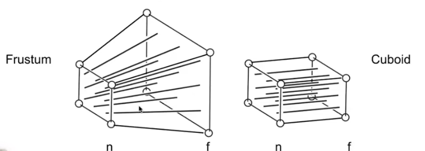
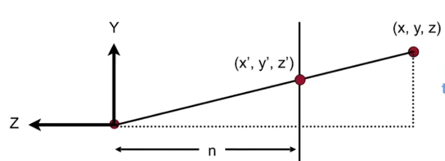

# 图形学 矩阵变换

## 模型-视图-投影

### 模型矩阵 Model Matrix

模型矩阵将模型的位置从初始位置变换到世界空间。

每个物体创建时，默认自己的初始位置是世界原点，即局部空间，通过平移、旋转、缩放改变物体的位置。平移改变物体位置，旋转改变模型朝向，缩放改变物体大小。

缩放矩阵一般表示为：

$$
\mathbf{S}(s_x, s_y, s_z) =
\begin{bmatrix}
s_x & 0 & 0 & 0 \\
0 & s_y & 0 & 0 \\
0 & 0 & s_z & 0 \\
0 & 0 & 0 & 1
\end{bmatrix}
$$

所有参数都在矩阵对角线上，意味着仅成比例变化物体空间矩阵。

旋转矩阵一般表示为（这里用绕Z轴旋转举例）：

$$
\mathbf{R}_z(\theta) =
\begin{bmatrix}
\cos\theta & -\sin\theta & 0 & 0 \\
\sin\theta & \cos\theta & 0 & 0 \\
0 & 0 & 1 & 0 \\
0 & 0 & 0 & 1
\end{bmatrix}
$$

平移矩阵一般表示为：

$$
\mathbf{T}(t_x, t_y, t_z) =
\begin{bmatrix}
1 & 0 & 0 & t_x \\
0 & 1 & 0 & t_y \\
0 & 0 & 1 & t_z \\
0 & 0 & 0 & 1
\end{bmatrix}
$$

借助三维物体空间齐次坐标为1的特性（稍后解释齐次坐标），通过矩阵乘法，将物体的坐标变为:
$$
\begin{bmatrix}
 x+t_x \\
 x+t_y \\
 x+t_z \\
  1
\end{bmatrix}
$$

通常先计算缩放和旋转，再计算平移。因为现阶段对空间坐标的计算以原点为中心，如果先进行平移的话，会导致物体位置随旋转一起变化。这也是矩阵乘法中不可交换的体现。

### 视图矩阵

在将物体放置到世界空间的指定位置、指定朝向后，还需要将物体从世界空间变换到视图空间，和摄像机的视角保持一致。

直观地想，要让物体正确显示在摄像机中，需要计算物体在视口中的移动、旋转、缩放，这样在计算时非常不直观，而且在视口内物体较多时，会极大增加计算的复杂度。

因此我们选择另一种思路：将指定位置的摄像机移动到世界原点，其他物体保持与摄像机的相对位置，使物体仍然在视口的原位置，同时大大简化了计算过程。即：

$$
\mathbf{V} = \mathbf{R^{-1}} * \mathbf{T} = \mathbf{R^T} * \mathbf{T}(-C_{pos})
$$

首先根据摄像机的世界坐标反向移动，然后再反向转动摄像机的角度（旋转矩阵的转置矩阵）。通常认为Y轴正方向为摄像机的上方，摄像机视口朝向Z轴负方向。

### 投影矩阵

投影矩阵用于将视图空间(view space)的物体坐标转换为裁剪空间(clip space)，为后续的视口映射（和透视处理，如果需要）做准备。投影矩阵主要分为透视投影矩阵和正交投影矩阵两种

#### 1.正交投影矩阵

在无透视效果、物体大小不随距离变化的时候使用，比如UI、2D渲染。

参数：

- left,right 左右裁剪面
- top,bottm 上下裁剪面
- near,far 近远裁剪面，在不同的图形API中正负不同，这里我们默认是负数

正交投影矩阵公式：
$
\begin{bmatrix}
\frac{2}{right-left} & 0 & 0 & -\frac{right+left}{right-left} \\
0 & \frac{2}{top-bottom} & 0 & -\frac{top+bottom}{top-bottom} \\
0 & 0 & -\frac{2}{far-near} & -\frac{far+near}{far-near} \\
0 & 0 & 0 & 1
\end{bmatrix}
$

正交投影矩阵负责生成裁剪空间坐标，以及将坐标变换为标准化设备坐标（NDC）。

#### 2.透视投影矩阵

模拟世界中近大远小的透视效果，用于大多数3D场景。

参数：

- fov 垂直视场角 Field of View
- aspect 宽高比 width/height
- near 近裁剪面距离 >0
- far 远裁剪面距离 >near

透视投影矩阵公式：
$
\begin{bmatrix}
\frac{1}{aspect*tan(\frac{fov}{2})} & 0 & 0 & 0\\
0 & \frac{1}{tan(\frac{fov}{2})} & 0 & 0 \\
0 & 0 & -\frac{far+near}{far-near} & -\frac{2*far*near}{far-near} \\
0 & 0 & -1 & 0
\end{bmatrix}
$

透视投影矩阵是怎么推导的？

为了在2D视口模拟出真实的3D效果，将视口可见的视椎体裁剪为一个截锥体(frustum)，并使用变换矩阵将截锥体内的顶点压缩为一个长方体(cuboid)。

根据顶点的比例，我们可以计算出 
$$ 
y' = y*\frac{n}{z}
$$

同理
$$ 
x' = x*\frac{n}{z}
$$

到这里，坐标z的压缩运算还不清楚。但是现在已知，位于近裁剪面和远裁剪面的点的坐标z不会变化，将已知值代入矩阵

$$
\begin{bmatrix}
n & 0 & 0 & 0\\
0 & n & 0 & 0 \\
0 & 0 & A & B \\
0 & 0 & 1 & 0
\end{bmatrix}
*
\begin{bmatrix}
x\\
y\\
? \\
z
\end{bmatrix}
$$

可以计算出最终的透视矩阵为

$$
\begin{bmatrix}
n & 0 & 0 & 0\\
0 & n & 0 & 0 \\
0 & 0 & near+far & -near*far \\
0 & 0 & 1 & 0
\end{bmatrix}
$$

在物体坐标经过透视矩阵变换后，就得到了可以直接正交投影的坐标矩阵。即完整的透视投影矩阵在推导上需要经过两步，先压缩坐标，再正交投影：

$$ M_{persp} = M_{ortho} M_{persp→ortho} $$

## 齐次坐标

对于三维(维度同样)坐标，表示坐标的旋转和缩放都可以简单地用矩阵乘法运算表示而不产生副作用，因为它们本身的属性也可以用乘法运算表示，和矩阵乘法运算相契合。但是平移运算是单纯的加法，如果使用矩阵乘法表示，很难简单地不按照比例进行加减法运算。

因此，我们在原维度的基础上，额外添加了一个维度，将三维向量转换为四维向量。这使得平移运算也可以用矩阵乘法来计算：

$$
\begin{bmatrix}
1 & 0 & 0 & t_x\\
0 & 1 & 0 & t_y \\
0 & 0 & 1 & t_z \\
0 & 0 & 0 & 1
\end{bmatrix}
*
\begin{bmatrix}
x\\
y \\
z \\
1
\end{bmatrix}
=
\begin{bmatrix}
x+t_x\\
y+t_y \\
z+t_z \\
1
\end{bmatrix}
$$

这使得平移运算支持级联，即多个变换只需矩阵乘法运算。

同时，齐次坐标也区分了点和向量。
||w(新增维度的最后一位)|性质|
|-|-|-|
|点|w>=1|平移时会移动，w>1时，需要将整体坐标/w|
|点|w=0|当 w = 0 且 (x, y, z) ≠ (0,0,0) 时，该齐次坐标表示一个方向上的无穷远点。|
|向量|w=0|平移时不变|