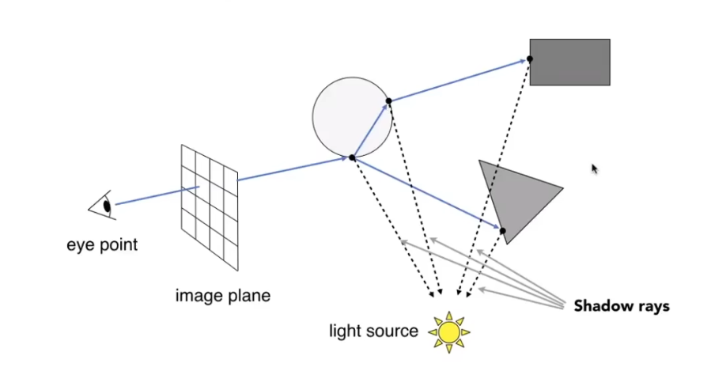
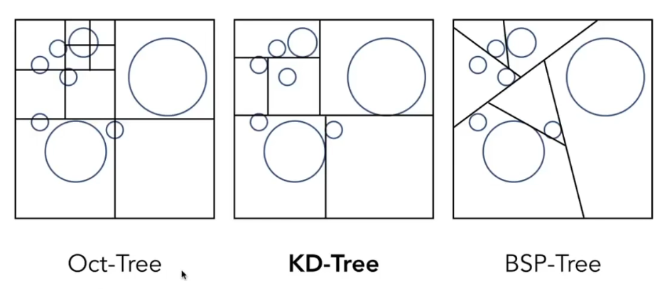
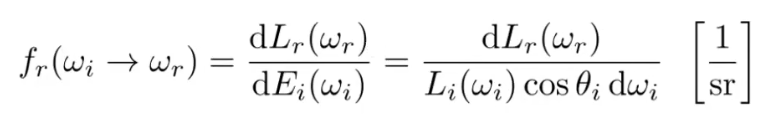
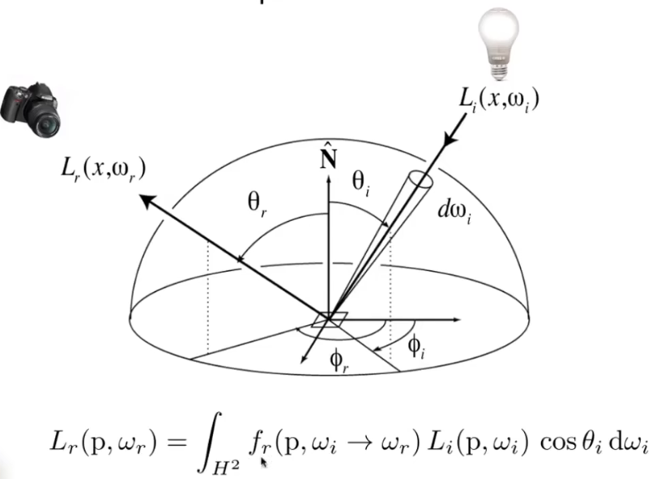
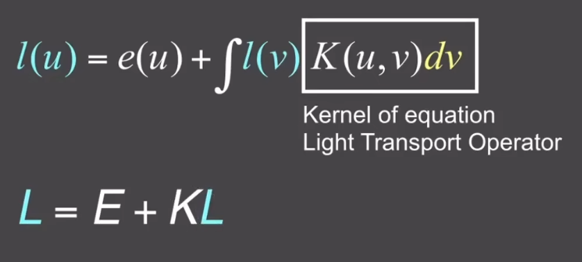
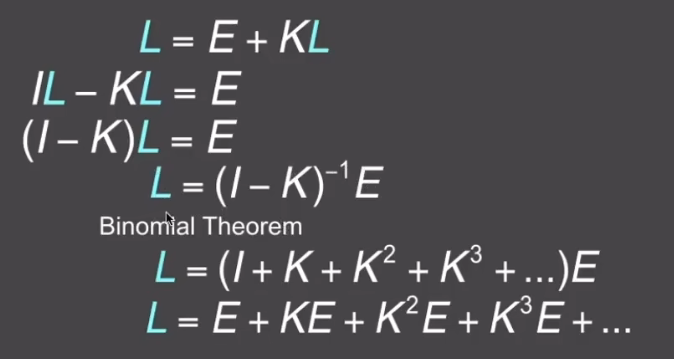
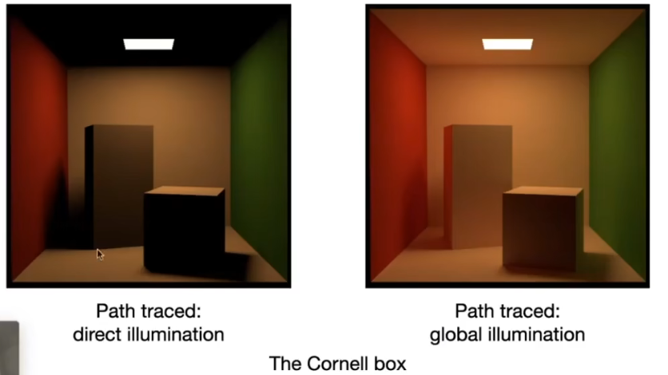

# 光线追踪

## 光线追踪和光栅化

光栅化（Rasterization）难以很好地处理全局光照效果，例如软阴影、镜面反射、间接光照等。光栅化的优点是速度快（实时），但质量有限；光线追踪则相反，速度慢（通常用于离线渲染），但效果逼真。

| 特性 | 光栅化 | 光线追踪 |
|------|--------|----------|
| 速度 | 快 | 慢 |
| 效果 | 局部光照 | 全局光照 |
| 阴影 | 硬阴影 | 软阴影 |
| 反射 | 有限 | 镜面/漫反射 |

## 光线追踪基础

### 光线的假设

1. 光线沿直线传播
2. 光线之间不会发生碰撞
3. 光路具有可逆性（从眼睛出发追踪光线与从光源出发等价）

### 光线方程

$$ r(t) = \mathbf{O} + t\mathbf{d}, \quad t \geq 0 $$

- $\mathbf{O}$：光线起点（相机位置）
- $\mathbf{d}$：光线方向（单位向量）
- $t$：沿光线传播的距离

### 光线投射 Ray Casting

基本流程：
1. 从相机向成像平面的每个像素发射光线
2. 找到与场景物体的最近交点
3. 连接交点到光源，判断是否在阴影中

> 如果在阴影中，只贡献环境光

4. 使用着色模型（如 Blinn-Phong）计算颜色

## 光线追踪 Whitted-Style

在光线投射的基础上，当光线击中物体时不停止，而是根据材质继续产生：
- 反射光线（Specular Reflection）
- 折射光线（Specular Refraction）

最终将所有交点的颜色按权重累加。

### 光线与物体求交

#### 与隐式曲面求交
将光线方程代入曲面方程 $f(p)=0$ 求解。

#### 与三角形求交 

对于与三角形求交，我们分为两步：
1. 判断光线与三角形所在平面的交点位置
2. 判断交点是否在三角形内

但是这个过程需要多步解方程，计算起来很不方便，Möller-Trumbore算法解决了这一点，这是求解光线与三角形交点的经典算法，直接通过重心坐标一步求得交点和重心坐标：

$$ \mathbf{O} + t\mathbf{d} = (1-b_1-b_2)\mathbf{v_0} + b_1\mathbf{v_1} + b_2\mathbf{v_2} $$

写成矩阵形式：

$$
\begin{bmatrix} t \\ b_1 \\ b_2 \end{bmatrix} =
\frac{1}{\mathbf{S}_1 \cdot \mathbf{E}_1}
\begin{bmatrix} \mathbf{S}_2 \cdot \mathbf{E}_2 \\ \mathbf{S}_1 \cdot \mathbf{S} \\ \mathbf{S}_2 \cdot \mathbf{d} \end{bmatrix}
$$

其中：
- $\mathbf{E}_1 = \mathbf{v}_1 - \mathbf{v}_0$
- $\mathbf{E}_2 = \mathbf{v}_2 - \mathbf{v}_0$
- $\mathbf{S} = \mathbf{O} - \mathbf{v}_0$
- $\mathbf{S}_1 = \mathbf{d} \times \mathbf{E}_2$
- $\mathbf{S}_2 = \mathbf{S} \times \mathbf{E}_1$

判断条件：
- $t > 0$（交点在光线前方）
- $b_1 > 0, b_2 > 0, 1 - b_1 - b_2 > 0$（交点在三角形内部）

但是场景中可能存在很多物体（巨量的三角形面），有一些三角形面明显地偏离光线穿过的位置，这些三角形面完全没有必要进行判断，因此，我们引入了加速结构来简化判断过程。

## 加速结构

### 轴对齐包围盒 AABB

用三对与坐标轴平行的平面构成长方体包围物体。如果光线连包围盒都碰不到，就不必与盒内物体求交。

求交算法：分别计算光线与三对平面的 $t_{min}$ 和 $t_{max}$：

$$ t_{enter} = \max(t_{min}^{(x)}, t_{min}^{(y)}, t_{min}^{(z)}) $$
$$ t_{exit} = \min(t_{max}^{(x)}, t_{max}^{(y)}, t_{max}^{(z)}) $$

相交条件：$t_{enter} < t_{exit} \ \text{且} \ t_{exit} \geq 0$

### 均匀网格 Uniform Grids

将场景包围盒划分为均匀网格，记录每个网格包含的物体。光线前进时依次检查经过的网格。

适用场景于物体分布均匀的场景，但是会造成空旷区域浪费，密集区域性能较差。

需要预处理将空间中划分的网格做标记，标记当前格子是否存在物体。

### 空间划分 Spatial Partitioning

为了解决均匀网格划分空间效果不佳的情况，我们采用不均匀的划分方式。

#### 八叉树 Oct-Tree

字面意思，每个节点有八个子节点，即在三维空间中沿xyz三条轴将空间均匀划分为八块。根据一定的规则决定是否再划分子节点。

#### KD-Tree

每次将空间用轴对齐平面二分，交替沿 X、Y、Z 轴方向划分，物体存储在叶子节点中。比八叉树划分的灵活度更高。

判断光线与物体是否有交集时首先判断包围盒是否有交点，逐步递归判断对应的子节点包围盒，直到叶子结点，再进行与具体物体的交点判断。

#### BSP-Tree

异形划分，不严格按照轴方向划分，计算起来比较复杂。

总体来讲，上述的KD-Tree综合性能最好，但是也存在几个比较麻烦的问题。

首先，判断一个三角形是否在对应的包围盒里是判断是否有顶点在包围盒内，但是会出现这种情况：三角形的三个顶点都不在包围盒内，但是三角形和包围盒存在交点。

举个例子，有一个三角形在包围盒的顶点位置，三角形面被包围盒的一个角穿过，但是三角形三个顶点都没有进入包围盒。这种情况很难计算，所以近年来实际应用KD树也在逐渐变少。

然后，对于空间的直接划分，可能会导致一个物体同时在一个以上的包围盒中，并不是太大的问题，但是确实是一个不太好的性质。

因此产生了另一种划分：物体划分

### BVH（Bounding Volume Hierarchy）

BVH是一种基于物体的划分方式，先划分物体，再计算包围盒，保证每个物体只属于一个节点。

构建方法：
1. 求场景总包围盒
2. 将物体分成两堆（按最长轴取中位数）
3. 分别计算两堆物体的包围盒
4. 递归直到节点内物体数足够少

对于物体的位置排序常用重心位置。

> BVH vs. KD-Tree：BVH 基于物体划分，实现更简单且没有物体重复问题，是实际中最常用的加速结构。

## 辐射度量学

Whitted-Style光追只是对光线的简单模拟，并不真实，为了物理准确地描述光照，需要引入辐射度量学。

| 物理量 | 符号 | 定义 | 单位 |
|--------|------|------|------|
| **Radiant Flux（功率）** | $\Phi = \frac{dQ}{dt}$ | 单位时间发出的能量 | W（瓦特） |
| **Radiant Intensity** | $I = \frac{d\Phi}{d\omega}$ | （光源）单位立体角的功率 | W/sr |
| **Irradiance** | $E = \frac{d\Phi}{dA}$ | （物体）单位面积的功率（接收） | W/m² |
| **Radiance** | $L = \frac{d^2\Phi}{dA d\omega \cos\theta}$ | 单位面积单位立体角的功率 | W/(m²·sr) |

- **Irradiance** 与 **Radiance** 的关系：$E = \int L \cos\theta \, d\omega$

### 双向反射分布函数 BRDF Bidirectional Reflectance Distribution Function

用于描述光线从某个方向进入物体表面，在反射出时应该反射出多少能量。

由此可以推导出物体的一个点最终应该反射的光线：

### 渲染方程

在渲染时，要考虑物体本身是否发光，以及外部的光线这两部分。

$$ L_o(p, \omega_o) = L_e(p, \omega_o) + \int_{\Omega} L_i(p, \omega_i) f_r(p, \omega_i, \omega_o) (n \cdot \omega_i) \, d\omega_i $$

- $L_o$：出射 Radiance
- $L_e$：自发光的 Radiance
- $L_i$：入射 Radiance
- $f_r$：BRDF（双向反射分布函数）
- $n \cdot \omega_i = \cos\theta_i$

在计算时只考虑半球，这是默认物体表面之下没有光源。

为了简化理解和计算，可以将这个复杂的公式化简。

在化简后，可以将光线传播的递归计算表示为类似泰勒展开的形式。

## 路径追踪 Path Tracing

### 蒙特卡洛积分

为了计算复杂函数的定积分，使用蒙特卡洛方法进行数值近似：

$$ \int_a^b f(x) \, dx \approx \frac{1}{N} \sum_{i=1}^{N} \frac{f(X_i)}{p(X_i)}, \quad X_i \sim p(x) $$

- $N$：采样次数（越大方差越小）
- $p(x)$：概率密度函数（PDF），满足 $\int p(x)dx = 1$

### Whitted-Style 的局限性

Whitted-Style 光线追踪存在几个问题：
- 只处理镜面反射和折射
- 遇到漫反射面就停止弹射
- 无法处理漫反射面之间的间接光照

### 直接光照的蒙特卡洛解法

假设着色点不发光，渲染方程简化为：

$$ L_o(p, \omega_o) = \int_{\Omega} L_i(p, \omega_i) f_r(p, \omega_i, \omega_o) \cos\theta_i \, d\omega_i $$

使用蒙特卡洛积分，按均匀概率 $p(\omega_i) = \frac{1}{2\pi}$ 采样半球面：

$$ L_o \approx \frac{1}{N} \sum_{i=1}^{N} \frac{L_i(p, \omega_i) f_r \cos\theta_i}{1/(2\pi)} = \frac{2\pi}{N} \sum_{i=1}^{N} L_i(p, \omega_i) f_r \cos\theta_i $$

当光线击中非光源物体时，需要递归计算该点的出射Radiance，但是由于采样时是多采样点，如果每次都产生同样多的递归，会导致平方级别的光线计算，产生光线爆炸问题。

### 光线爆炸问题

如果每个着色点采样 $N$ 条光线，经过 $b$ 次弹射后，总光线数为 $N^b$，指数爆炸。

解决方案：令 $N = 1$

$$ L_o \approx 2\pi \cdot L_i(p, \omega_i) f_r \cos\theta_i $$

但是这又产生了一个很明显的问题，如果采样数量低至1，会产生巨大的噪声。对于这个问题，我们使用在一个采样点内均匀发射多条光线，再对这些采样光线做均值处理。

这就是路径追踪名称的由来，通过每个像素发射多条路径、多条路径平均来计算最终效果。

### 递归终止问题

光线理论上可以无限弹射，需要一种方法在不引入偏差的情况下终止递归。

我们采用概率停止的方式来终止递归，以概率 $P$ 继续追踪，返回 $L_o / P$，以概率 $1-P$ 停止追踪，返回 $0$

可以证明，这样得到的期望值与正确值相等：

$$ E = P \cdot (L_o/P) + (1-P) \cdot 0 = L_o $$

### 光源采样优化

如果完全靠半球随机方向采样，光线很可能碰不到光源（尤其是当光源面积小时），导致大量无效采样。因此实际计算时，直接对光源进行采样

将渲染方程拆分为：

$$ L_o = \underbrace{\int_{\text{光源}} L_i f_r \cos\theta \, d\omega}_{直接光照} + \underbrace{\int_{\text{其他物体}} L_i f_r \cos\theta \, d\omega}_{间接光照} $$

对光源采样需进行积分变量转换（从立体角 $d\omega$ 转换到光源面积 $dA$）：

$$ d\omega = \frac{dA \cdot \cos\theta'}{r^2} $$

其中 $\theta'$ 是光源表面法线与光线方向的夹角，$r$ 是两点间距离。

于是直接光照部分变为：

$$ L_{\text{dir}} = \int_{\text{光源}} L_i(p, \omega_i) f_r \cos\theta \cdot \frac{\cos\theta'}{r^2} \, dA $$

按均匀概率 $p(A) = 1/A$ 采样：

$$ L_{\text{dir}} \approx \frac{A}{N} \sum_{i=1}^{N} L_i(p, \omega_i) f_r \cdot \frac{\cos\theta \cdot \cos\theta'}{r^2} $$

对于其他非光源的采样，计算时应该跳过已经采样过的光源方向光线。

在计算直接光照时，还需判断光源是否被遮挡：
- 从着色点向采样到的光源点发射 Shadow Ray
- 如果路径上有物体阻挡，则该光源点贡献为 0
