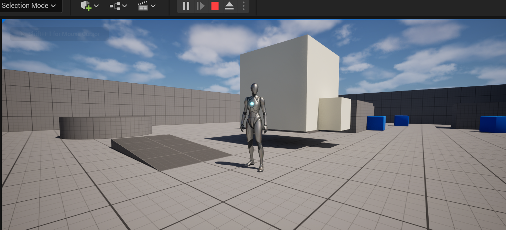

# 在UE5中使用CRTP

> UE5中的反射对象不支持模版化，不可以直接采用CRTP优化继承链中对象的虚函数开销，但是可以通过多重继承实现CTRP工具类，通过调用工具类实现静态多态。

## 1.CRTP(Curiously Recurring Template Pattern)

> 第一部分部分简述CRTP，比较了解可以直接阅读第二部分实现部分

[cppreference原文链接-CRTP](https://en.cppreference.com/w/cpp/language/crtp.html)

CRTP(Curiously Recurring Template Pattern)，奇异递归模板模式，特征为将派生类作为基类的模版参数，形如:
```cpp
template <typename T>
class Base {
    // methods within Base can use template to access members of Derived
};

class Derived : public Base<Derived> {
    // ...
};
```

一般用于实现静态多态、物体计数等，这里我们针对UE的性能问题，主要讨论静态多态。在基础的多态实现上，一般使用虚函数+重写的方式实现对象动态多态，这种方式会带来虚表开销（在大多数编译器中）。

主要表现在：

 - 含有虚方法的类中添加一个隐藏的成员变量，该变量指向一个包含虚函数的指针数组，成为虚方法表；
 
 - 此外，和直接指针跳转的非虚方法调用相比，虚函数调用至少需要一次解引用，且不利于分支预测，导致CPU产生惩罚周期。导致在时间和空间上均有一定程度的开销。

以下为实现用例：

 ```cpp
 template <typename T> 
struct Base {
    void call() {
        // ...
        static_cast<T*>(this)->implementation();
        // ...
    }

    static void staticFunc() {
        // ...
        T::staticSubFunc();
        // ...
    }
};

struct Derived : public Base<Derived> {
    void implementation() {
        // ...
    }

    static void staticSubFunc() {
        // ...
    }
};
```
在这段代码中，利用基类模版函数并不会立即实例化这一点，先传入模版参数（声明了基类模版调用方法的参数类型），即首先完整定义Derived，再等待类实例化，后续调用它时编译器已知Derived::implemention的声明。
通过编译时确定调用的具体方法，实现了类似虚表的效果，但是没有动态多态带来的额外开销。

缺点是想切换行为就需要重写代码，重新编译，且使用容器时难以存储这种异构对象，对于UE中使用，序列化上也有很大难度。

### 如果不实现动态多态也不使用CRTP会怎么样？

对于没有重写的非虚函数，派生类会直接调用基类函数的方法，这种情况下如果基类函数的方法调用了基类的其它方法，即使派生类重写了虚函数，也不会调用派生类的函数，而是仍然调用基类方法。


## 2.UE5中使用CRTP

UE5的UObject对象及其派生类可以通过`UCLASS()`宏使UObject处理系统注意到这些类，从而在编辑器中处理这些对象。

UE5的反射系统基于UnrealBuildTool(UBT)实现，大致流程为首先使用UnrealHeaderTool(UHT)处理`.h`文件，根据c++头文件中类对象的宏解析宏的参数，如`Specifier`和`metadata`等，以及解析类对象的信息，如继承信息和成员函数等，生成对应的c++信息；然后再继续调用UBT进行正式编译。

由于该阶段UHT第一步解析为简单的静态文本扫描，显然不支持解析模版类，在大多数编译器中，模版类在实例化之前不会确定模版参数类型，文本扫描时也就无法获得类对象的完整信息。

> 理论上如果在UHT解析阶段进行一次预编译，生成模版类型确定的类对象，或者对模版类型单独进行语法解析然后替换掉参与UHT处理的部分，应该可以实现支持模版类型反射？

因此，直接使用模版实现UObject对象在UE5中是不可行的。在UE5中对CRTP的实现我们采用了间接的方式，即另新建一个CTRP头文件，专门用于实现该模式。

---

首先是基类和派生类的实现，在派生类中仅重写了`ChangeSize()`改变比例函数，为了在编辑器中体现可以正常使用。

::: code-group
```cpp [ActorBase.h]
//...
UCLASS()
class FORLEARN_API AActorBase : public AActor
{
	GENERATED_BODY()
public:	
	AActorBase();

    //...

	void ChangeSize();
	void MakeChange();
};
```
```cpp [ActorBase.cpp]
//...
void AActorBase::ChangeSize()
{
	SetActorScale3D(FVector(1.1f));
}
void AActorBase::MakeChange()
{
	this->ChangeSize();
}
//...
```
```cpp [ActorDerived.h]
//需要在`ActorDerived.h`中继承`TActorBaseCRTP`才能正常使用。
UCLASS()
class FORLEARN_API AActorDerived : public AActorBase, public TActorBaseCTRP<AActorDerived>
{
	//...
};
```
```cpp [ActorDerived.cpp]
//...
void AActorDerived::BeginPlay()
{
	Super::BeginPlay();
	//MakeChange();
	MakeChangeCTRP();
}
void AActorDerived::ChangeSize()
{
	SetActorScale3D(FVector(3.0f));
}
//...
```
```cpp [TActorBaseCRTP.h]
template<typename T>
class TActorBaseCTRP
{
public:
	void MakeChangeCTRP() {
		static_cast<T*>(this)->ChangeSize();
	}
};
```
:::

至此已经实现全部逻辑，运行检验是否成功。



两个物体初始赋值同样的引擎自带资源，运行后明显大小变化，改动有效。